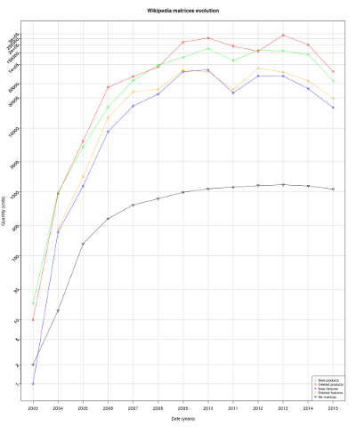

# pcm-stats

Wikipedia metrics generation on comparison table pages

## Goal

This project aims to retreive the maximum information about matrix (comparison tables) creation and edition history on the Wikipedia page revisions to give visibility and drive the functional developpement of the main project, OpenCompare.

## Limits

As wikitext is an ambiguous and human editing language, there are some limitations towards matrices identification inside a page. Like moved matrices inside different section (used to name them) unables the facility to identify and compare same matrices of different revisions. The position inside the page can also vary, this main problem remains the same.

An other difficulty is to identify pages containing matrices, there is no such tools on Wikipedia API to do so. And parsing all pages revisions to search matrices would be a huge server resources consuption (especialy in an international context).

## Database

Sqlite has been firstly used to prevent issues and data loss from originaly csv file accessed throught threads. Secondly, it allows to create custom select requests to manage metrics processing easier than in a csv file.

### Metamodel

### Backups

Before each launch, the database is saved, postfixed by the date of the day.

## Functional processes

### Main launcher

The main class is `org.opencompare.stats.Launcher` which launches sequentialy the two main processes as follow.

### Grab wikitext and metadatas from page revisions

This task is done by `org.opencompare.stats.processes.Revisions` class. It reads a custom csv page list to know wich page to parse.

This process uses several other classes such as :

  - `org.opencompare.stats.utils.RevisionsParser` helps to provide an easiest way to retreive revisions metadata
  - `org.opencompare.io.wikipedia.io.MediaWikipediaApi` provides a scala API interface to the Wikipedia API

#### Performance issues and resources

Due to performance issues (tested in a quadcore AMD processor with 8GB RAM, it lasts 7 hours), it's preferable to add these options to the JVM (see http://www.oracle.com/technetwork/java/javase/tech/vmoptions-jsp-140102.html for further explaination) to ensure any Java stack and GC limitation exceptions :

 - -Xmx5120m
 - -XX:-UseParallelOldGC
 - -XX:InitiatingHeapOccupancyPercent=10

To spare some Wikipedia servers resources (and already time consuption) when a revision has been processed, the revision's associated wikitext is not retreived next times the script is launched.
If the output folder `metrics` is deleted, the script regenerates all the necessary files before processing.

### Parse the wikitext from revisions and make metrics !

This task is done by `org.opencompare.stats.processes.Metrics` class.

This process uses several other classes such as :

  - `org.opencompare.stats.utils.RevisionsComparator` returns the comparison between all matrices through revisions
  - `org.opencompare.io.wikipedia.io.WikiTextLoader` returns a `org.opencompare.api.java.PCMContainer` list containing revision matrices to be compared

#### Performance issues

Like the wikitext grabbing process, a line previously created will not be reprocessed to save database access by using a simple SELECT instead of an INSERT.

### Compute metrics to obtain graphical interpretation

Use of R to process the graphical representation of metrics. Scripts are located in `r-metrics`.

## R

Once main processes finished, launch the R scripts to process graphical representation.

    cd r-metrics
    Rscript metrics_log.R => top have a full logarithmic metrics view
    Rscript metrics_revisions.R => to have a linear comparison between changes and revisions
    Rscript revisions_matrices.R => to have a linear comarison between revisions and matrices
    
### Depencencies

    RSqlite
