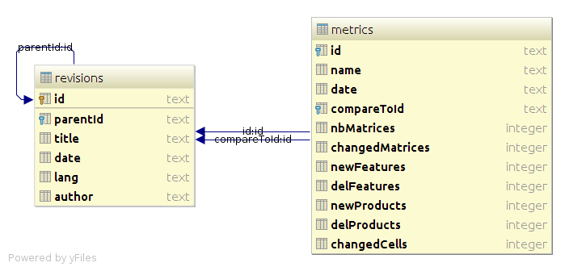

# pcm-stats

## Technologies

### Database

Sqlite has been used to prevent issues and data loss from originally csv file access throught threads.

#### Metamodel

## Processes

### Grab wikitext from page revisions

Due to performance issues, it's preferable to add these options to the JVM (see http://www.oracle.com/technetwork/java/javase/tech/vmoptions-jsp-140102.html for further explaination)
 - -Xmx5120m
 - -XX:-UseParallelOldGC
 - -XX:InitiatingHeapOccupancyPercent=10
 
Due to performance issues throught wikipedia server access, when a revision has been processed, the next time the script is launched, the revision's associated wikitext is not retreived.
If the folder `metrics` is deleted, the script regenerates all the necessary files before process.

### Parse the wikitext to make metrics on matrix evolution

Use of org.opencompare.{api, io} dependencies. Especially `MediaWikipediaApi` class.

### Compute metrics to obtain graphical interpretation

Use of R to process the graphical representation of metrics

## Launch processes

The main class is `org.opencompare.stats.Launcher` which launch sequentially, the two main processes `org.opencompare.stats.launchers.Revisions`, `org.opencompare.stats.launchers.Metrics`.